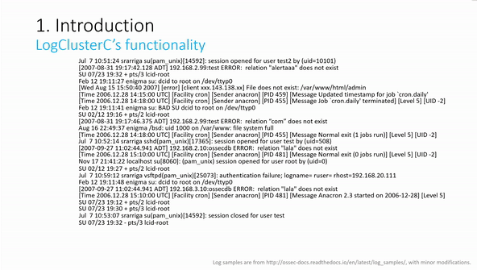

# C-based Implementation of LogCluster Algorithm

Video Demo (content is same as the above GIF): [Vimeo](https://vimeo.com/433554834)

Executable File Download: [Google Drive](https://drive.google.com/drive/folders/1X0Kv1O9mHvxNCU2XaVkYsafQ_KPFg2kF?usp=sharing)

---

Compiling Environment: Linux

**How to manually compile the source files:**
In terminal, change directory to this folder and execute "gcc -O2 -o logclusterc *.c" command. The executable file named "logclusterc" then will be generated.

LogCluster is a density-based data clustering algorithm for event logs, introduced by Risto Vaarandi and Mauno Pihelgas in 2015.
 
A detialed discussion of the LogCluster algorithm can be found in the paper (http://ristov.github.io/publications/cnsm15-logcluster-web.pdf) published at CNSM 2015.

The C-based implementation of LogCluster algorithm is called LogClusterC.

LogClusterC borrows lots of source code from another open source data mining tool SLCT: http://ristov.github.io/slct/ .

The information of LogCluster algorithm and its prototype implementation in Perl: http://ristov.github.io/logcluster/ .

The history versions of LogCluster in Perl: https://github.com/ristov/logcluster/releases .

All the functions in LogCluster Perl version 0.03 are supported in LogClusterC. The basic functions and heuristics functions (options: --input, --rsupport, 
--support, --aggrsup, --wweight) are tested via various experiments in thesis.

# 基于文字密度的文本数据挖掘工具

运行环境：Linux

**如何编译：**下载源文件后，命令行输入 gcc -O2 -o logclusterc *.c

此工具基于Risto Vaarandi和Mauno Pihelgas发明的LogCluster算法，这是一个基于文本密度的数据挖掘算法，主要应用于大规模日志的模式分析。

LogCluster算法的Perl版本: https://github.com/ristov/logcluster/

LogCluster算法的前身SLCT算法：http://ristov.github.io/slct/